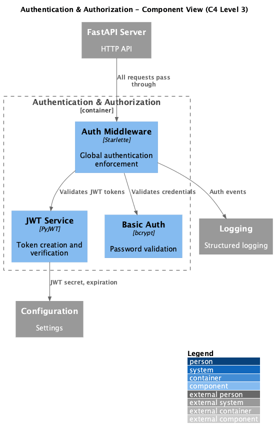

# Container: Authentication & Authorization

<!-- Last updated: 2025-12-13 -->

**Parent:** [System Context](../../context.md)

JWT token generation/validation and basic authentication. Optional global auth middleware. Protects API endpoints with configurable credential schemes.

## Diagram

## Technology

| Aspect | Value |
|--------|-------|
| Framework | PyJWT, bcrypt |
| Methods | JWT Bearer tokens, HTTP Basic Auth |
| Entry Point | `ingenious/auth/jwt.py`, `ingenious/auth/middleware.py` |

## Drill Down - Components

| Component | Responsibility | Details |
|-----------|----------------|---------|
| JWT Service | Token creation and verification | [View](./components/jwt-service/component.md) |
| Auth Middleware | Global authentication enforcement | [View](./components/auth-middleware/component.md) |

## Dependencies

### External Systems
- None

### Other Containers
- Configuration System: JWT secret, expiration settings
- Logging System: Authentication event logging

## Token Configuration

| Setting | Default | Description |
|---------|---------|-------------|
| Algorithm | HS256 | JWT signing algorithm |
| Access Token Expiry | 1440 min (24h) | Access token lifetime |
| Refresh Token Expiry | 7 days | Refresh token lifetime |
| Secret Key Source | `INGENIOUS_JWT_SECRET_KEY` | Environment variable |

## Exempt Paths

The following paths are exempt from authentication:
- `/docs`, `/openapi.json` - API documentation
- `/api/v1/auth/*` - Authentication endpoints
- `/health`, `/ready` - Health checks
