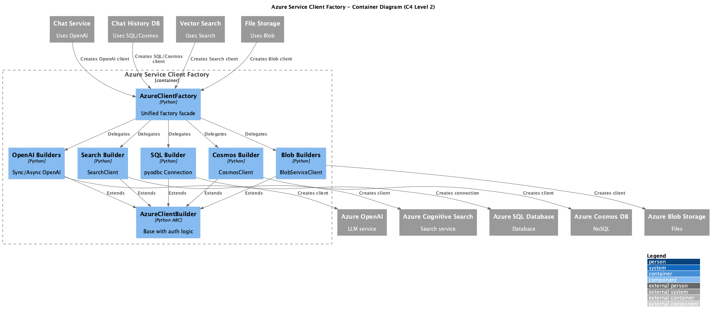

# Container: Azure Service Client Factory

<!-- Last updated: 2025-12-13 -->

**Parent:** [System Context](../../context.md)

Factory for creating Azure service clients (OpenAI, SQL, Cosmos, Search, Blob) with appropriate authentication methods and configuration. Uses Builder pattern for flexible client construction.

## Diagram

## Technology

| Aspect | Value |
|--------|-------|
| Framework | Azure SDK for Python |
| Pattern | Builder, Abstract Factory |
| Entry Point | `ingenious/client/azure/azure_client_builder_factory.py` |

## Drill Down - Components

| Component | Responsibility | Details |
|-----------|----------------|---------|
| Builder Base | Abstract base with authentication | [View](./components/builder-base/component.md) |
| OpenAI Builders | Azure OpenAI client builders | [View](./components/openai-builders/component.md) |
| Search Builder | Azure Search client builder | [View](./components/search-builder/component.md) |
| Database Builders | SQL and Cosmos client builders | [View](./components/database-builders/component.md) |
| Blob Builders | Blob Storage client builders | [View](./components/blob-builders/component.md) |
| Factory | Unified client factory | [View](./components/factory/component.md) |

## Dependencies

### External Systems
- Azure OpenAI
- Azure Cognitive Search
- Azure SQL Database
- Azure Cosmos DB
- Azure Blob Storage

### Other Containers
- Configuration System: Service credentials and endpoints

## Authentication Methods

| Method | Description |
|--------|-------------|
| TOKEN | API key with AzureKeyCredential |
| DEFAULT_CREDENTIAL | Azure CLI, environment, managed identity chain |
| MSI | System or user-assigned Managed Identity |
| CLIENT_ID_AND_SECRET | Service principal with client credentials |
