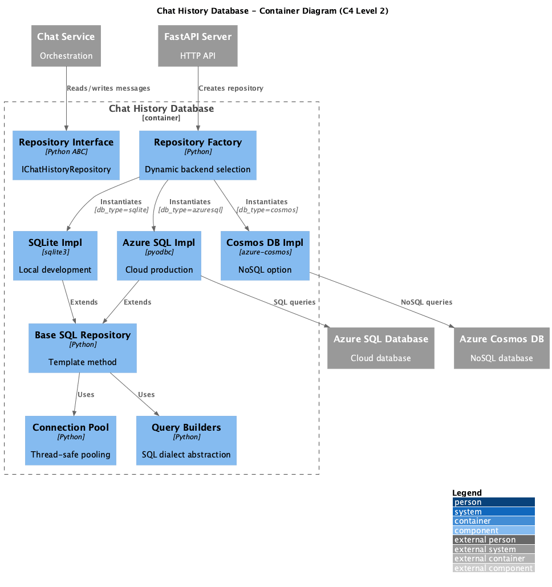

# Container: Chat History Database

<!-- Last updated: 2025-12-13 -->

**Parent:** [System Context](../../context.md)

Stores conversation history and messages. Supports multiple backends: SQLite (local), Azure SQL (cloud), Cosmos DB (NoSQL cloud). Implements repository pattern for data access.

## Diagram

## Technology

| Aspect | Value |
|--------|-------|
| Backends | SQLite, Azure SQL (pyodbc), Azure Cosmos DB |
| Pattern | Repository, Factory, Template Method |
| Entry Point | `ingenious/db/chat_history_repository.py` |

## Drill Down - Components

| Component | Responsibility | Details |
|-----------|----------------|---------|
| Repository Interface | IChatHistoryRepository abstract interface | [View](./components/repository-interface/component.md) |
| Data Models | ChatHistory, User, Thread, Message entities | [View](./components/data-models/component.md) |
| Repository Factory | Dynamic backend selection | [View](./components/repository-implementation/component.md) |
| Base SQL Repository | Template method for SQL backends | [View](./components/base-repository/component.md) |
| Connection Pool | Thread-safe connection management | [View](./components/connection-pool/component.md) |
| Query Builders | Database-agnostic SQL generation | [View](./components/query-builders/component.md) |
| SQLite Implementation | Local development backend | [View](./components/sqlite-impl/component.md) |
| Azure SQL Implementation | Cloud production backend | [View](./components/azuresql-impl/component.md) |
| Cosmos DB Implementation | NoSQL backend option | [View](./components/cosmos-impl/component.md) |

## Dependencies

### External Systems
- Azure SQL Database: Cloud relational storage
- Azure Cosmos DB: Cloud NoSQL storage

### Other Containers
- Configuration System: Database connection settings
- Azure Client Builders: For Azure database clients

## Data Model

| Entity | Description |
|--------|-------------|
| User | User identity with metadata |
| Thread | Conversation thread with tags |
| Message | Individual message with role, content, feedback |
| ChatHistory | Denormalized history record |
