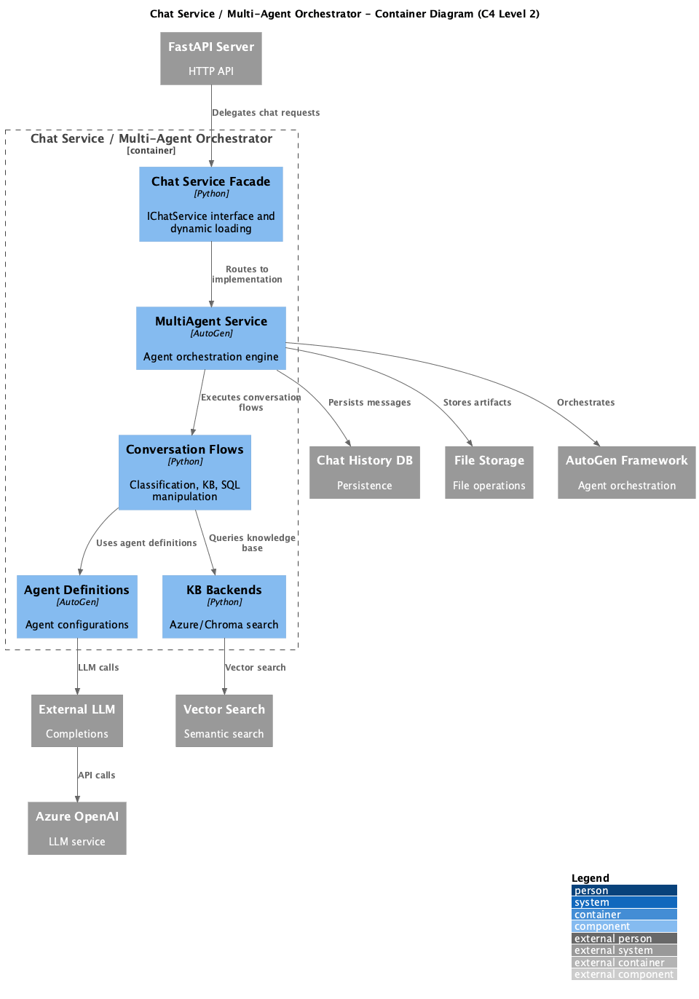

# Container: Chat Service / Multi-Agent Orchestrator

<!-- Last updated: 2025-12-13 -->

**Parent:** [System Context](../../context.md)

Multi-agent conversation orchestration layer using AutoGen. Routes requests to conversation flows (classification, knowledge-base, SQL manipulation). Manages agent lifecycle and inter-agent communication.

## Diagram

## Technology

| Aspect | Value |
|--------|-------|
| Framework | Microsoft AutoGen 0.5.7 |
| Runtime | Python AsyncIO |
| Entry Point | `ingenious/services/chat_services/multi_agent/service.py` |

## Drill Down - Components

| Component | Responsibility | Details |
|-----------|----------------|---------|
| Service Interface | IChatService abstract interface | [View](./components/service-interface/component.md) |
| Service Implementation | ChatService facade with dynamic loading | [View](./components/service-implementation/component.md) |
| Multi-Agent Service | AutoGen orchestration engine | [View](./components/multi-agent-service/component.md) |
| Conversation Flows | Pluggable workflow patterns | [View](./components/conversation-flows/component.md) |
| Agents | Agent definitions and configurations | [View](./components/agents/component.md) |
| KB Backends | Azure/Chroma search backends | [View](./components/knowledge-base-backends/component.md) |

## Dependencies

### External Systems
- Microsoft AutoGen: Agent orchestration framework
- Azure OpenAI: LLM completions

### Other Containers
- Chat History DB: Persists conversation state
- Vector Search: Knowledge base retrieval
- External LLM Service: LLM API calls
- File Storage: Artifact storage
- Logging System: Event logging
- Configuration System: Settings

## Conversation Flows

| Flow | Description | Source Path |
|------|-------------|-------------|
| Classification Agent | User intent classification | `conversation_flows/classification_agent/` |
| Knowledge Base Agent | Document retrieval and QA | `conversation_flows/knowledge_base_agent/` |
| SQL Manipulation | SQL query generation | `conversation_flows/sql_manipulation_agent/` |
