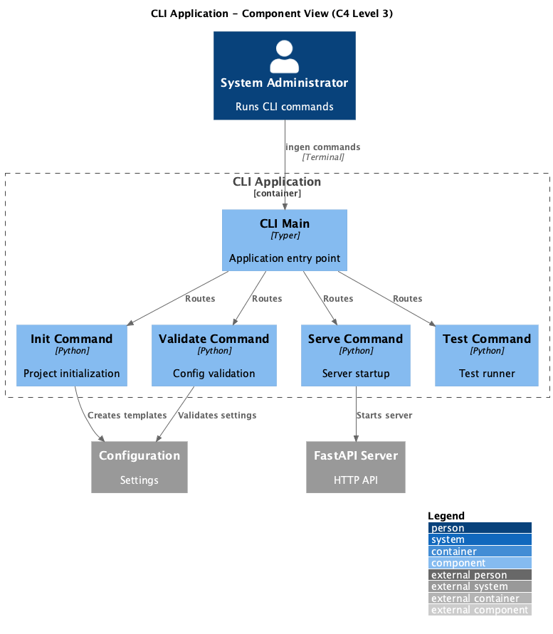

# Container: CLI Application

<!-- Last updated: 2025-12-13 -->

**Parent:** [System Context](../../context.md)

Command-line interface (ingen CLI) for project initialization, configuration validation, server startup, and testing. Entry point defined in pyproject.toml.

## Diagram



## Technology

| Aspect | Value |
|--------|-------|
| Framework | Typer, Rich |
| Entry Point | `ingen` command, `ingenious/cli/main.py` |

## Drill Down - Components

| Component | Responsibility | Details |
|-----------|----------------|---------|
| CLI Main | Typer application setup | [View](./components/cli-main/component.md) |
| Command Modules | Individual CLI commands | [View](./components/command-modules/component.md) |

## Dependencies

### External Systems
- None

### Other Containers
- Configuration System: Load and validate settings
- FastAPI Server: Start/stop server

## Commands

| Command | Description |
|---------|-------------|
| `ingen init` | Initialize new project with templates |
| `ingen serve` | Start the API server |
| `ingen validate` | Validate configuration |
| `ingen test` | Run test suite |

## Usage Examples

```bash
# Initialize a new project
ingen init my-project

# Start server on custom port
ingen serve --port 8000

# Validate configuration
ingen validate

# Run tests
ingen test
```
