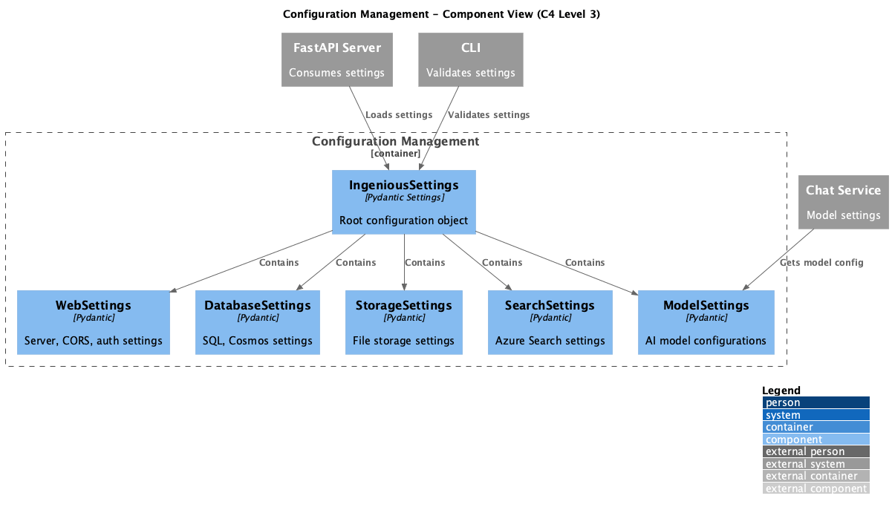

# Container: Configuration Management

<!-- Last updated: 2025-12-13 -->

**Parent:** [System Context](../../context.md)

Pydantic-settings based configuration system. Loads from environment variables (INGENIOUS_* prefix), .env files, and provides structured settings validation.

## Diagram

## Technology

| Aspect | Value |
|--------|-------|
| Framework | Pydantic Settings 2.x |
| Pattern | Configuration Object, Composition |
| Entry Point | `ingenious/config/main_settings.py` |

## Drill Down - Components

| Component | Responsibility | Details |
|-----------|----------------|---------|
| Settings Root | IngeniousSettings root configuration | [View](./components/settings-root/component.md) |
| Settings Models | Individual configuration models | [View](./components/settings-models/component.md) |

## Dependencies

### External Systems
- None

### Other Containers
- None (this is a foundational container)

## Configuration Sections

| Section | Model | Description |
|---------|-------|-------------|
| models | `List[ModelSettings]` | AI model configurations |
| chat_history | `ChatHistorySettings` | Database backend selection |
| web_configuration | `WebSettings` | Server, CORS, auth settings |
| azure_search | `AzureSearchSettings` | Azure Search configuration |
| azure_sql | `AzureSqlSettings` | Azure SQL configuration |
| cosmos | `CosmosSettings` | Cosmos DB configuration |
| file_storage | `FileStorageSettings` | File storage configuration |
| logging | `LoggingSettings` | Logging configuration |

## Environment Variables

All settings use the `INGENIOUS_` prefix with nested notation:
- `INGENIOUS_MODELS__0__API_KEY` - First model's API key
- `INGENIOUS_CHAT_HISTORY__DATABASE_TYPE` - Database type
- `INGENIOUS_WEB_CONFIGURATION__PORT` - Server port

## .env Files (load order)

1. `.env` - Base configuration
2. `.env.local` - Local overrides
3. `.env.dev` - Development settings
4. `.env.prod` - Production settings
