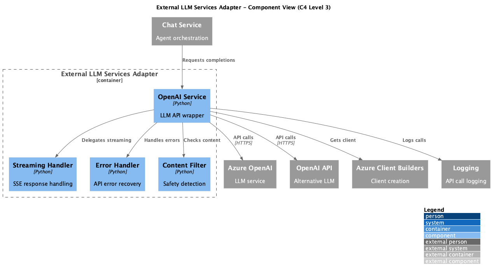

# Container: External LLM Services Adapter

<!-- Last updated: 2025-12-13 -->

**Parent:** [System Context](../../context.md)

Wrapper for external LLM API interaction. Provides error handling, streaming support, content filtering, and token limit detection.

## Diagram

## Technology

| Aspect | Value |
|--------|-------|
| Framework | OpenAI SDK, Azure OpenAI |
| Pattern | Adapter, Facade |
| Entry Point | `ingenious/external_services/openai_service.py` |

## Drill Down - Components

| Component | Responsibility | Details |
|-----------|----------------|---------|
| OpenAI Service | LLM API wrapper | [View](./components/openai-service/component.md) |

## Dependencies

### External Systems
- Azure OpenAI: Primary LLM service
- OpenAI API: Alternative LLM service

### Other Containers
- Azure Client Builders: OpenAI client creation
- Logging System: API call logging

## Features

| Feature | Description |
|---------|-------------|
| Streaming | Server-sent events for response streaming |
| Error Handling | Graceful handling of API errors |
| Content Filtering | Detection and handling of content filter results |
| Token Limits | Detection of context length issues |

## Methods

| Method | Description |
|--------|-------------|
| `create_chat_completion` | Synchronous completion |
| `create_chat_completion_stream` | Streaming completion |
