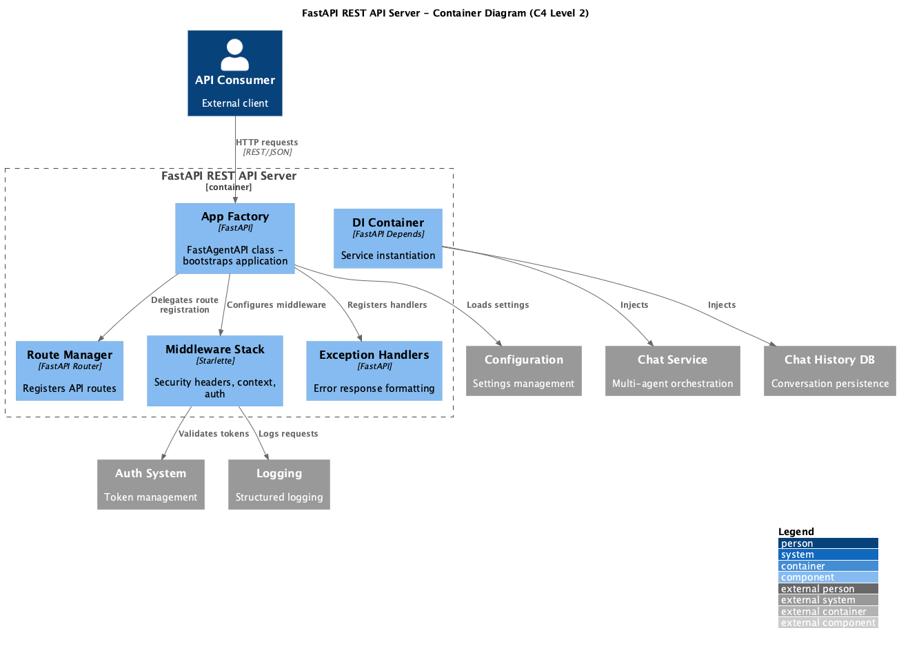

# Container: FastAPI REST API Server

<!-- Last updated: 2025-12-13 -->

**Parent:** [System Context](../../context.md)

The core HTTP API server providing endpoints for chat, conversations, authentication, custom workflows, and system diagnostics. Handles request routing, dependency injection, middleware stack (CORS, auth, security headers).

## Diagram

## Technology

| Aspect | Value |
|--------|-------|
| Framework | FastAPI 0.115.9 |
| Runtime | Python 3.13+, Uvicorn |
| Entry Point | `ingenious/main/app_factory.py` |

## Drill Down - Components

| Component | Responsibility | Details |
|-----------|----------------|---------|
| App Factory | Bootstraps FastAPI application | [View](./components/app-factory/component.md) |
| Routing | Route registration and management | [View](./components/routing/component.md) |
| Middleware | Request/response processing | [View](./components/middleware/component.md) |
| Exception Handling | Error response formatting | [View](./components/exception-handling/component.md) |
| Dependency Injection | Service instantiation via DI | [View](./components/dependency-injection/component.md) |

## Dependencies

### External Systems
- None directly (delegates to other containers)

### Other Containers
- Chat Service: For processing chat requests
- Chat History DB: For conversation persistence
- Auth System: For token validation
- Configuration System: For loading settings
- Logging System: For structured logging

## API Endpoints

| Endpoint | Method | Description |
|----------|--------|-------------|
| `/api/v1/chat` | POST | Process chat message |
| `/api/v1/chat/stream` | POST | Stream chat response |
| `/api/v1/conversations` | GET | List conversations |
| `/api/v1/auth/token` | POST | Generate JWT token |
| `/api/v1/health` | GET | Health check |
| `/docs` | GET | OpenAPI documentation |
