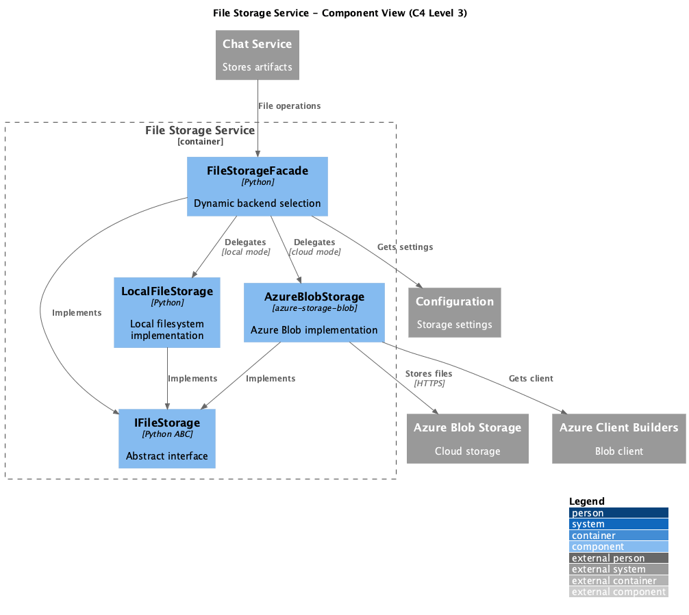

# Container: File Storage Service

<!-- Last updated: 2025-12-13 -->

**Parent:** [System Context](../../context.md)

Abstraction for file operations. Supports local filesystem and Azure Blob Storage backends for document processing and knowledge base management.

## Diagram

## Technology

| Aspect | Value |
|--------|-------|
| Backends | Local filesystem, Azure Blob Storage |
| Pattern | Repository, Strategy, Facade |
| Entry Point | `ingenious/files/files_repository.py` |

## Drill Down - Components

| Component | Responsibility | Details |
|-----------|----------------|---------|
| File Storage Interface | IFileStorage abstract interface | [View](./components/file-storage-interface/component.md) |
| File Storage Facade | Dynamic backend selection | [View](./components/file-storage-facade/component.md) |
| Azure Storage | Azure Blob implementation | [View](./components/azure-storage/component.md) |
| Local Storage | Local filesystem implementation | [View](./components/local-storage/component.md) |

## Dependencies

### External Systems
- Azure Blob Storage: Cloud file storage

### Other Containers
- Configuration System: Storage settings
- Azure Client Builders: Blob client creation

## Operations

| Method | Description |
|--------|-------------|
| `write_file` | Write content to file |
| `read_file` | Read file content |
| `delete_file` | Delete a file |
| `list_files` | List files in path |
| `list_directories` | List subdirectories |
| `check_if_file_exists` | Check file existence |
| `get_base_path` | Get storage base path |
