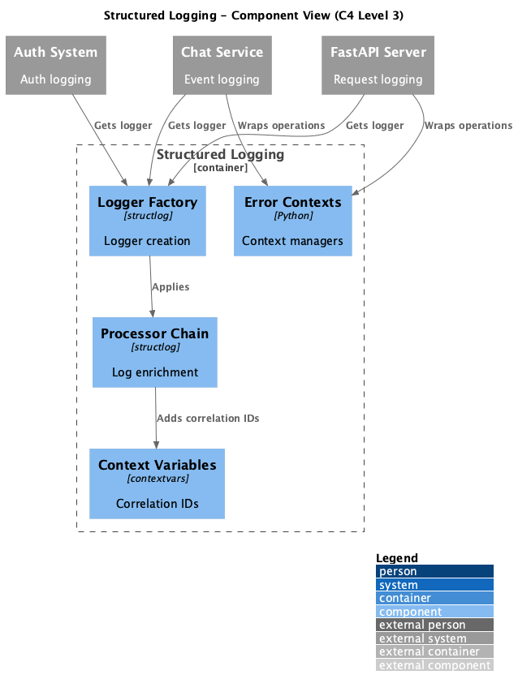

# Container: Structured Logging

<!-- Last updated: 2025-12-13 -->

**Parent:** [System Context](../../context.md)

Structured logging with correlation IDs using structlog library. Configurable log levels and output formatting for debugging and monitoring.

## Diagram

## Technology

| Aspect | Value |
|--------|-------|
| Framework | structlog |
| Pattern | Processor Chain, Context Variables |
| Entry Point | `ingenious/core/structured_logging.py` |

## Drill Down - Components

| Component | Responsibility | Details |
|-----------|----------------|---------|
| Structured Logging | Logger factory and processors | [View](./components/structured-logging/component.md) |
| Error Handling | Context managers and recovery | [View](./components/error-handling/component.md) |

## Dependencies

### External Systems
- None

### Other Containers
- None (cross-cutting concern)

## Context Variables

| Variable | Description |
|----------|-------------|
| `request_id_ctx` | Request correlation ID |
| `user_id_ctx` | Authenticated user ID |
| `session_id_ctx` | Session identifier |

## Processors

| Processor | Description |
|-----------|-------------|
| `add_correlation_id` | Adds request/user/session IDs |
| `add_timestamp` | Adds ISO timestamp |
| `add_logger_name` | Adds module name |
| `add_performance_metrics` | Adds memory/CPU (optional) |

## Error Handling

| Context Manager | Use Case |
|-----------------|----------|
| `operation_context` | Generic operation wrapping |
| `database_operation` | Database operations with retry |
| `api_operation` | API operations with correlation |
| `file_operation` | File operations |
| `workflow_operation` | Workflow execution |
