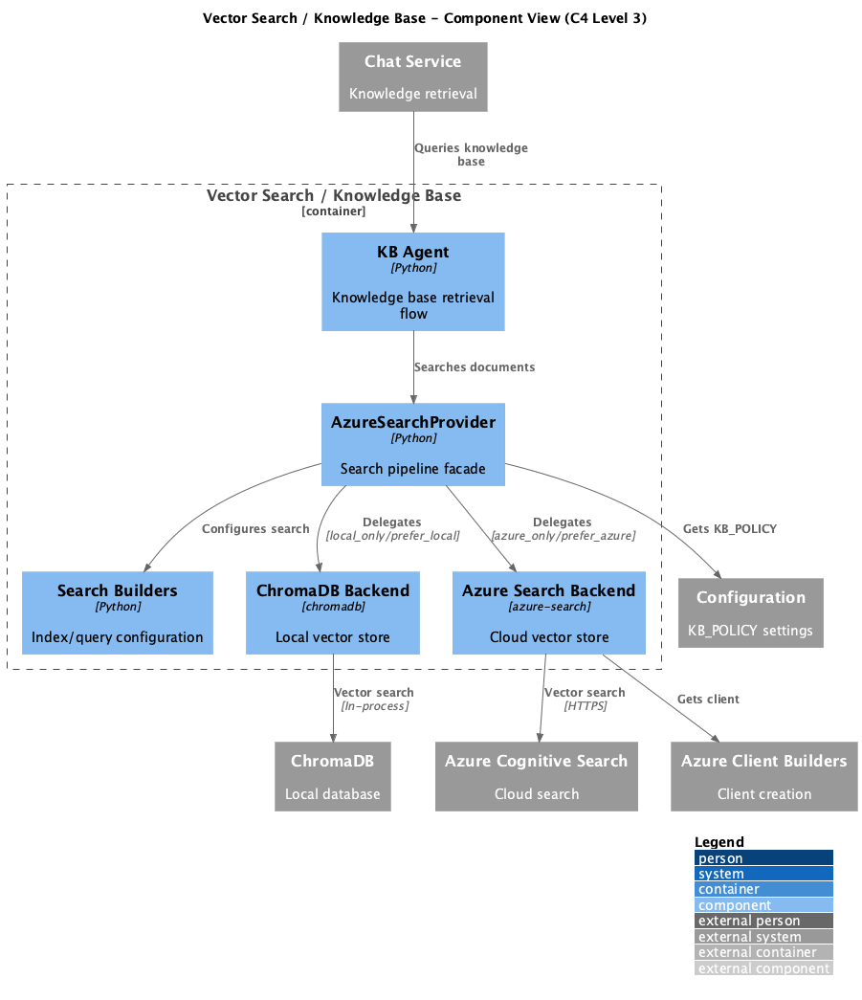

# Container: Vector Search / Knowledge Base

<!-- Last updated: 2025-12-13 -->

**Parent:** [System Context](../../context.md)

Vector similarity search for document retrieval. Supports ChromaDB (local) and Azure Cognitive Search (cloud). Powers knowledge-base-agent conversation flow.

## Diagram

## Technology

| Aspect | Value |
|--------|-------|
| Backends | Azure Cognitive Search, ChromaDB |
| Pattern | Strategy, Abstract Factory |
| Entry Point | `ingenious/services/azure_search/provider.py` |

## Drill Down - Components

| Component | Responsibility | Details |
|-----------|----------------|---------|
| Azure Search Builders | Configuration validation | [View](./components/azure-search-builders/component.md) |
| Azure Search Provider | Search pipeline facade | [View](./components/azure-search-provider/component.md) |
| KB Agent | Knowledge base retrieval flow | [View](./components/kb-agent/component.md) |

## Dependencies

### External Systems
- Azure Cognitive Search: Enterprise vector search
- ChromaDB: Local vector database

### Other Containers
- Configuration System: Search endpoint settings
- Azure Client Builders: Search client creation
- Chat Service: Uses for knowledge retrieval

## Backend Selection

Controlled by `KB_POLICY` environment variable:

| Policy | Behavior |
|--------|----------|
| `local_only` | Use ChromaDB only |
| `azure_only` | Use Azure Search only |
| `prefer_azure` | Azure with local fallback |
| `prefer_local` | Local with Azure fallback |

## Search Configuration

| Setting | Description |
|---------|-------------|
| `KB_TOPK_DIRECT` | Number of results for direct queries |
| `KB_TOPK_ASSIST` | Number of results for assist mode |
| `KB_MODE` | Search mode (direct/assist) |
