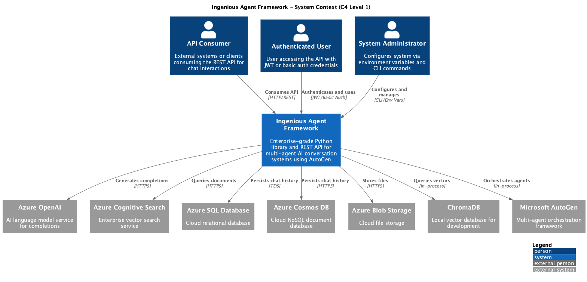

# System Context: Ingenious Agent Framework

<!-- Last updated: 2025-12-13 -->
<!-- Generated by: c4-map Phase 1 -->

An enterprise-grade Python library and REST API for rapidly deploying multi-agent AI conversation systems. Ingenious provides FastAPI-based API endpoints for AI-driven interactions using AutoGen, supporting both local development (SQLite, ChromaDB) and production Azure deployments (Azure OpenAI, Azure SQL, Cosmos DB, Azure AI Search, Azure Blob). The system orchestrates autonomous agents through pluggable conversation flows to handle classification, knowledge retrieval, and SQL manipulation workflows.

## Diagram

## Actors

| Actor | Description |
|-------|-------------|
| API Consumer | External systems or clients consuming the REST API endpoints for chat interactions, conversation management, and workflow execution |
| Authenticated User | User accessing the API with JWT or basic authentication credentials |
| System Administrator | Administrator configuring the system via environment variables and CLI commands (ingen init, serve, validate, test) |

## External Systems

| System | Type | Description |
|--------|------|-------------|
| Azure OpenAI | AI Service | Language model service for chat completions and embeddings |
| Azure Cognitive Search | Search Service | Enterprise vector search for knowledge base retrieval |
| Azure SQL Database | Database | Cloud relational database for chat history persistence |
| Azure Cosmos DB | Database | Cloud NoSQL document database for chat history |
| Azure Blob Storage | File Storage | Cloud storage for files and documents |
| ChromaDB | Vector Database | Local vector database for development and testing |
| Microsoft AutoGen | AI Framework | Multi-agent orchestration framework for conversation flows |
| OpenAI API | AI Service | Direct OpenAI API access (alternative to Azure OpenAI) |

## Drill Down - Containers

| Container | Technology | Description | Details |
|-----------|------------|-------------|---------|
| FastAPI REST API Server | FastAPI 0.115.9, Uvicorn | Main HTTP server handling all client requests | [View](./containers/fastapi-server/container.md) |
| Chat Service | Python AsyncIO, AutoGen 0.5.7 | Multi-agent conversation orchestration | [View](./containers/chat-service/container.md) |
| Chat History Database | SQLite/Azure SQL/Cosmos DB | Conversation history persistence | [View](./containers/chat-history-db/container.md) |
| Vector Search | Azure Cognitive Search, ChromaDB | Semantic search and knowledge base | [View](./containers/vector-search/container.md) |
| Authentication System | JWT, HTTP Basic Auth | Token generation and validation | [View](./containers/auth-system/container.md) |
| CLI Application | Typer, Rich | Command-line interface | [View](./containers/cli/container.md) |
| Configuration Management | Pydantic Settings 2.x | Environment-based configuration | [View](./containers/configuration-system/container.md) |
| Structured Logging | structlog | Correlation tracking and logging | [View](./containers/logging-system/container.md) |
| Azure Client Builders | Azure SDK, Builder Pattern | Azure service client factory | [View](./containers/azure-client-builders/container.md) |
| File Storage | Azure Blob, Local FS | File operations abstraction | [View](./containers/file-storage/container.md) |
| External LLM Service | OpenAI SDK | LLM API adapter | [View](./containers/external-llm-service/container.md) |
